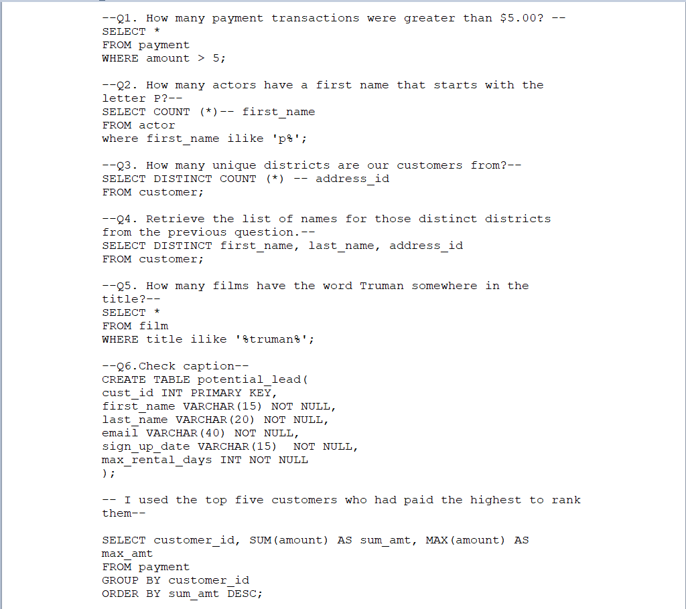
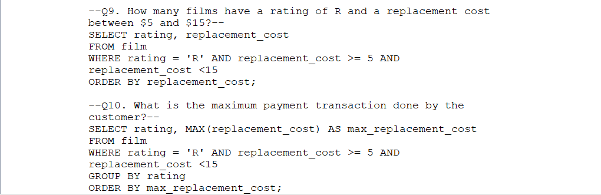

# 📊 SQL Query Practice with Sakila Database

This repository contains a set of SQL queries executed against the **Sakila Sample Database** using **PostgreSQL**. The queries address common data analysis tasks such as data filtering, aggregation, sorting, joining, and data manipulation.

---

## 🗂️ Contents

The queries in this project explore:

- Filtering data using `WHERE`, `LIKE`, `ILIKE`
- Counting unique values and aggregating data with `COUNT`, `SUM`, `MAX`
- Creating and inserting into custom tables
- Ranking and grouping results using `GROUP BY`, `ORDER BY`, `HAVING`
- Logical operations and constraints in table design

---

## 🧠 Practice Questions and Objectives

### ✅ Basic Retrieval and Filtering
- **Q1:** How many payment transactions were greater than $5?
- **Q2:** How many actors have a first name that starts with the letter P?
- **Q3:** How many unique districts are our customers from?
- **Q4:** Retrieve the list of names for those distinct districts.

### 🎬 Film Metadata Queries
- **Q5:** How many films have the word *"Truman"* in their title?
- **Q9:** How many films are rated *R* with a replacement cost between $5 and $15?
- **Q10:** What is the maximum replacement cost for *R* rated films?

### 💼 Customer and Payment Insights
- **Q6:** Create a `potential_lead` table with the top five customers by total amount paid.
- **Q7:** What customer has the highest ID, whose name starts with 'E' and address ID is less than 500?
- **Q8:** Return customer IDs of those who spent at least $110 with a specific staff member.

---

## 📋 Sample SQL Snippets

```sql
-- Q1: Retrieve transactions over $5
SELECT * 
FROM payment 
WHERE amount > 5;

-- Q2: Count actors with names starting with 'P'
SELECT COUNT(*) 
FROM actor 
WHERE first_name LIKE 'P%';

-- Q6: Create a potential_lead table
CREATE TABLE potential_lead(
    cust_id INT PRIMARY KEY,
    first_name VARCHAR(15) NOT NULL,
    last_name VARCHAR(20) NOT NULL,
    email VARCHAR(40) NOT NULL,
    sign_up_date VARCHAR(15) NOT NULL,
    max_rental_days INT NOT NULL
);
```
## 🧾 Execution Flow
The queries were run sequentially to:

Filter and explore data within the payment, customer, film, and rental tables

Create and populate a new potential_lead table

Identify top-paying customers and patterns among films and users

## 🖼️ Screenshots
Here are the screenshots showcasing the SQL queries and output:

Part 1	Part 2	Part 3

, , and 

---
## 📌 Tools Used
PostgreSQL for SQL execution

pgAdmin for GUI-based query execution

Sakila Sample Database for real-world data modeling
---
## 📬 Feedback
Feel free to fork this repo, suggest improvements, or reach out if you have questions or suggestions.
